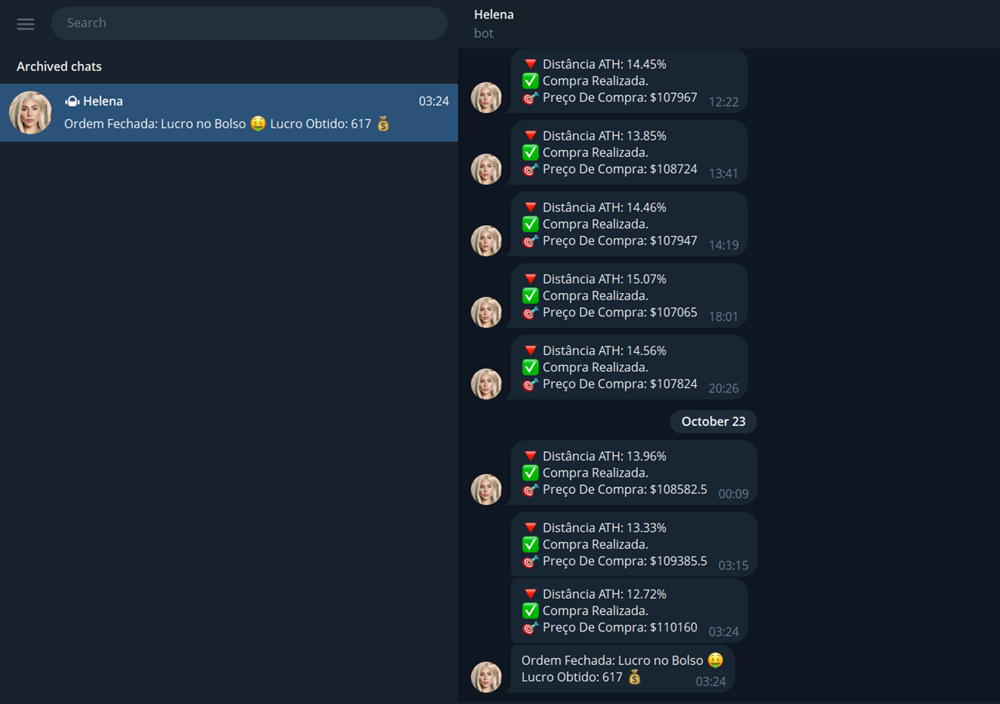

# ⚡ Automação LN Markets - V004
- Uma automação que opera contratos futuros de Bitcoin via LN Markets. Monitora o preço do BTC em tempo real e executa ordens com base em critérios definidos pelo usuário. Posições são fechadas automaticamente com base no lucro líquido esperado, levando em conta taxas de abertura, fechamento e funding. A automação também conta com um sistema de gestão de risco via injeção de margem e está atualmente hospedada em uma instância EC2 da AWS com tmux.

### 🚀 TECNOLOGIAS UTILIZADAS
- **ln-markets** – integração com a API da exchange LN Markets;
- **python-decouple** – gerenciamento seguro de variáveis de ambiente;
- **AWS EC2** – deploy em nuvem com execução contínua;
- **tmux** – execução persistente de scripts em servidores;

### 📌 FUNCIONALIDADES
- Detecção automática de variações significativas no preço do BTC;
- Execução de ordens com margem e alavancagem configuradas pelo usuário;
- Fechamento de posições com lucro esperado, considerando taxas de carry e operacionais;
- Consulta e gerenciamento de ordens abertas em tempo real;
- Injeção automática de margem ao se aproximar do preço de liquidação;

### 🧠 APRENDIZADOS
- Integração segura com a API da LN Markets usando autenticação por chave;
- Construção de lógica de decisão baseada em variáveis de mercado (preço, saldo, risco);
- Deploy de scripts em cloud com execução contínua via EC2 + tmux;
- Estratégias básicas de gerenciamento de risco para minimizar perdas;

### 🧪 CASO QUEIRA TESTAR
- Crie uma conta na LN Markets e gere sua chave API;
- Configure as variáveis LNM_KEY, LNM_SECRET, LNM_PASSPHRASE, LNM_NETWORK, TOKEN_TELEGRAM, ID_TELEGRAM em um arquivo .env;
- Só vai funcionar em tempo de execução. Caso queira 24/7, precisa subir para uma instância EC2 da AWS;
- Então basta abrir o terminal e digitar:
```bash
git clone https://github.com/Leayxz/Helena.git
pip install -r deps.txt
python _index.py
```

### 📚 CONCLUSÃO E CRÉDITOS

- Projeto prático em Python que integra a API da LN Markets para operar futuros de Bitcoin automaticamente, com lógica de decisão baseada em preço, risco e margem. Automatiza notificações em Telegram e garante execução contínua em AWS EC2 com tmux. Demonstra como pequenas automações combinadas com gestão de risco e integração de APIs podem gerar resultados eficientes em tempo real.

- Desenvolvido por **Leandro R. Martins**.

### 📸 IMAGENS DA EXECUÇÃO


